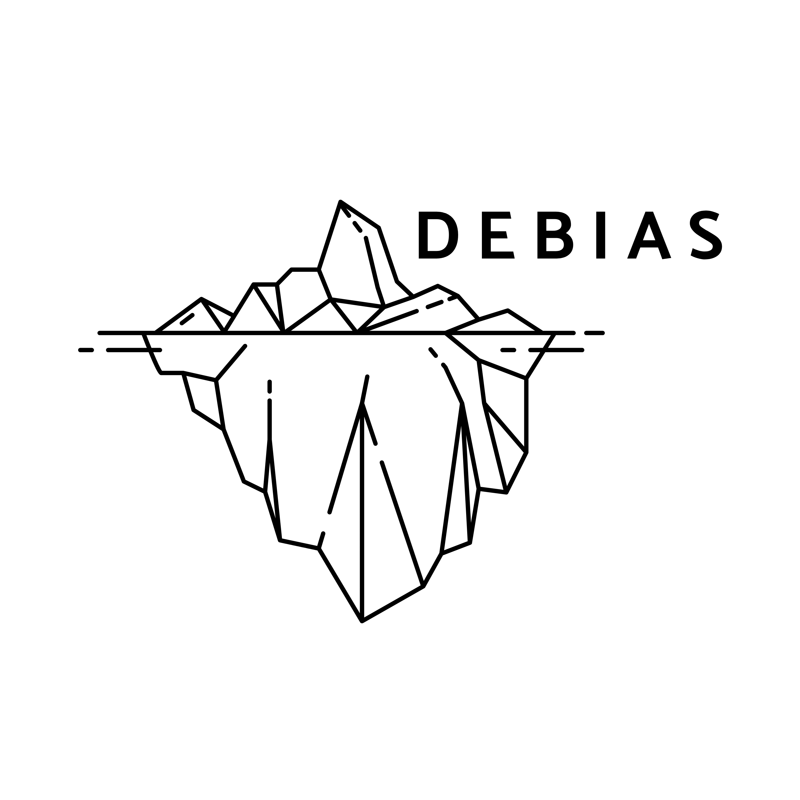

Welcome to **DEBIAS**

# Welcome to *DEBIAS* 🌍

*DEBIAS* is transforming the way we use digital mobility data by creating the first generalisable framework to detect and correct biases in human movement derived from mobile phones. Its innovations ensure mobility insights are fair, representative and actionable—transforming biased digital traces into reliable evidence for science, policy, and urban resilience.
**Here are a few ways to get involved:**

- ☎️ Check our updates [updates](https://de-bias.github.io/debias/updates/)
- 🔍 Explore more on our [website](https://de-bias.github.io/debias/)
- 🙌🏽 Contribute to the debiasR package — coming soon!
